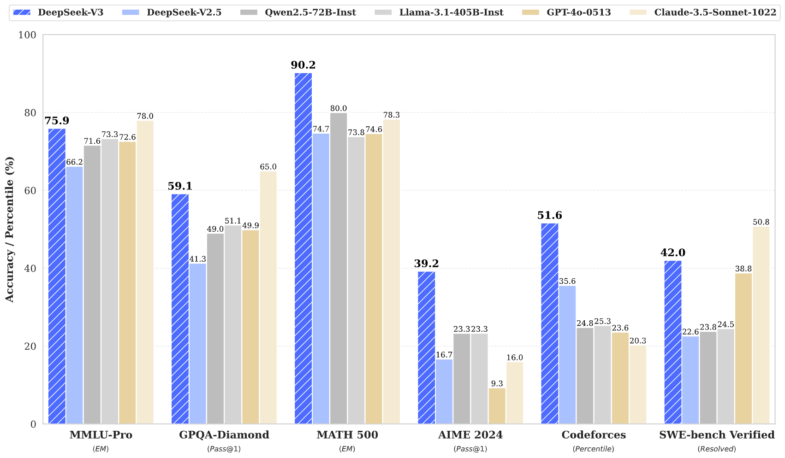
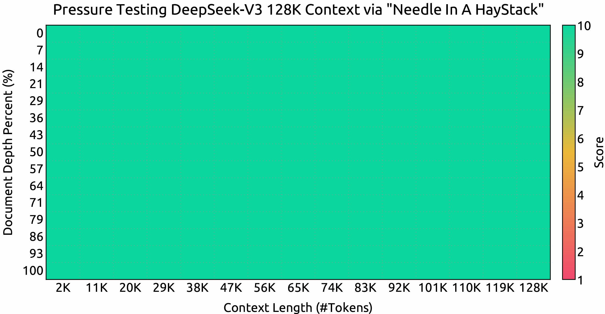

<!-- markdownlint-disable first-line-h1 -->
<!-- markdownlint-disable html -->
<!-- markdownlint-disable no-duplicate-header -->

<div align="center">
  
</div>
<hr>
<div align="center" style="line-height: 1;">
  <a href="https://www.deepseek.com/" target="_blank" style="margin: 2px;">
    
  </a>
  <a href="https://chat.deepseek.com/" target="_blank" style="margin: 2px;">
    
  </a>
  <a href="https://huggingface.co/deepseek-ai" target="_blank" style="margin: 2px;">
    
  </a>
</div>

<div align="center" style="line-height: 1;">
  <a href="https://discord.gg/Tc7c45Zzu5" target="_blank" style="margin: 2px;">
    
  </a>
  <a href="https://github.com/deepseek-ai/DeepSeek-V2/blob/main/figures/qr.jpeg?raw=true" target="_blank" style="margin: 2px;">
    
  </a>
  <a href="https://twitter.com/deepseek_ai" target="_blank" style="margin: 2px;">
    
  </a>
</div>

<div align="center" style="line-height: 1;">
  <a href="https://github.com/deepseek-ai/DeepSeek-V3/blob/main/LICENSE-CODE" style="margin: 2px;">
    
  </a>
  <a href="https://github.com/deepseek-ai/DeepSeek-V3/blob/main/LICENSE-MODEL" style="margin: 2px;">
    
  </a>
</div>


<p align="center">
  <a href="DeepSeek_V3.pdf"><b>论文链接</b>👁️</a>
</p>

## 目录

1. [简介](#1-简介)
2. [模型摘要](#2-模型摘要)
3. [模型下载](#3-模型下载)
4. [评测结果](#4-评测结果)
5. [聊天网站与API平台](#5-聊天网站与api平台)
6. [本地运行指南](#6-本地运行指南)
7. [许可证](#7-许可证)
8. [引用](#8-引用)
9. [联系方式](#9-联系方式)


## 1. 简介

我们推出了 DeepSeek-V3，这是一款强大的专家混合（MoE）语言模型，总参数量达 6710 亿，每个 token 激活 370 亿参数。为实现高效推理和低成本训练，DeepSeek-V3 采用了多头潜在注意力（MLA）和 DeepSeekMoE 架构，这些架构已在 DeepSeek-V2 中充分验证。此外，DeepSeek-V3 首创无辅助损失的负载均衡策略，并设定了多 token 预测训练目标以提升性能。我们在 14.8 万亿高质量多样化 token 上进行了预训练，随后通过有监督微调和强化学习阶段充分发挥模型能力。全面评测显示，DeepSeek-V3 超越了其他开源模型，并达到了与主流闭源模型相当的性能。尽管性能卓越，DeepSeek-V3 完整训练仅需 278.8 万 H800 GPU 小时，且训练过程极为稳定，未出现不可恢复的损失波动或回滚。
<p align="center">
  
</p>

## 2. 模型摘要

---

**架构：创新负载均衡策略与训练目标**

- 在 DeepSeek-V2 高效架构基础上，首创无辅助损失的负载均衡策略，最大限度减少因负载均衡带来的性能损失。
-  探索多 token 预测（MTP）目标，并证明其有助于提升模型性能，同时可用于推理加速的 speculative decoding。

---

**预训练：极致训练效率**

- 设计了 FP8 混合精度训练框架，并首次在超大规模模型上验证了 FP8 训练的可行性与有效性。
- 通过算法、框架与硬件协同设计，突破了跨节点 MoE 训练的通信瓶颈，几乎实现了计算与通信的完全重叠，大幅提升训练效率并降低成本，使模型规模得以进一步扩展而无额外开销。
- 仅用 266.4 万 H800 GPU 小时完成了 DeepSeek-V3 在 14.8T token 上的预训练，产出了当前最强的开源基础模型。预训练后的后续训练阶段仅需 10 万 GPU 小时。

---

**后训练：从 DeepSeek-R1 蒸馏知识**

- 创新性地将长链式思维（CoT）模型（DeepSeek R1 系列之一）的推理能力蒸馏到标准 LLM（尤其是 DeepSeek-V3）中。我们的流程巧妙融合了 R1 的验证与反思模式，显著提升了 DeepSeek-V3 的推理能力，同时对输出风格和长度进行了有效控制。

---


## 3. 模型下载

<div align="center">

| **模型** | **总参数量** | **激活参数量** | **上下文长度** | **下载链接** |
| :------------: | :------------: | :------------: | :------------: | :------------: |
| DeepSeek-V3-Base | 6710亿 | 370亿 | 128K   | [🤗 Hugging Face](https://huggingface.co/deepseek-ai/DeepSeek-V3-Base)   |
| DeepSeek-V3   | 6710亿 | 370亿 |  128K   | [🤗 Hugging Face](https://huggingface.co/deepseek-ai/DeepSeek-V3)   |

</div>

> [!注意]
> Hugging Face 上 DeepSeek-V3 模型总大小为 6850 亿参数，包括主模型权重 6710 亿和多 token 预测（MTP）模块权重 140 亿。

为确保最佳性能与灵活性，我们与开源社区和硬件厂商合作，提供多种本地运行方式。详细步骤请参见第 6 节：[本地运行指南](#6-本地运行指南)。

开发者如需深入了解，建议查阅 [README_WEIGHTS.md](./README_WEIGHTS.md)，了解主模型权重和 MTP 模块详情。MTP 支持正在社区积极开发中，欢迎贡献和反馈。

## 4. 评测结果
### 基础模型
#### 标准基准

<div align="center">


|  | 基准测试（指标） | 样本数 | DeepSeek-V2 | Qwen2.5 72B | LLaMA3.1 405B | DeepSeek-V3 |
|---|-------------------|----------|--------|-------------|---------------|---------|
| | 架构 | - | MoE | Dense | Dense | MoE |
| | 激活参数量 | - | 210亿 | 720亿 | 405亿 | 370亿 |
| | 总参数量 | - | 2360亿 | 720亿 | 405亿 | 6710亿 |
| 英文 | Pile-test (BPB) | - | 0.606 | 0.638 | **0.542** | 0.548 |
| | BBH (EM) | 3-shot | 78.8 | 79.8 | 82.9 | **87.5** |
| | MMLU (Acc.) | 5-shot | 78.4 | 85.0 | 84.4 | **87.1** |
| | MMLU-Redux (Acc.) | 5-shot | 75.6 | 83.2 | 81.3 | **86.2** |
| | MMLU-Pro (Acc.) | 5-shot | 51.4 | 58.3 | 52.8 | **64.4** |
| | DROP (F1) | 3-shot | 80.4 | 80.6 | 86.0 | **89.0** |
| | ARC-Easy (Acc.) | 25-shot | 97.6 | 98.4 | 98.4 | **98.9** |
| | ARC-Challenge (Acc.) | 25-shot | 92.2 | 94.5 | **95.3** | **95.3** |
| | HellaSwag (Acc.) | 10-shot | 87.1 | 84.8 | **89.2** | 88.9 |
| | PIQA (Acc.) | 0-shot | 83.9 | 82.6 | **85.9** | 84.7 |
| | WinoGrande (Acc.) | 5-shot | **86.3** | 82.3 | 85.2 | 84.9 |
| | RACE-Middle (Acc.) | 5-shot | 73.1 | 68.1 | **74.2** | 67.1 |
| | RACE-High (Acc.) | 5-shot | 52.6 | 50.3 | **56.8** | 51.3 |
| | TriviaQA (EM) | 5-shot | 80.0 | 71.9 | 82.7 | **82.9** |
| | NaturalQuestions (EM) | 5-shot | 38.6 | 33.2 | **41.5** | 40.0 |
| | AGIEval (Acc.) | 0-shot | 57.5 | 75.8 | 60.6 | **79.6** |
| 代码 | HumanEval (Pass@1) | 0-shot | 43.3 | 53.0 | 54.9 | **65.2** |
| | MBPP (Pass@1) | 3-shot | 65.0 | 72.6 | 68.4 | **75.4** |
| | LiveCodeBench-Base (Pass@1) | 3-shot | 11.6 | 12.9 | 15.5 | **19.4** |
| | CRUXEval-I (Acc.) | 2-shot | 52.5 | 59.1 | 58.5 | **67.3** |
| | CRUXEval-O (Acc.) | 2-shot | 49.8 | 59.9 | 59.9 | **69.8** |
| 数学 | GSM8K (EM) | 8-shot | 81.6 | 88.3 | 83.5 | **89.3** |
| | MATH (EM) | 4-shot | 43.4 | 54.4 | 49.0 | **61.6** |
| | MGSM (EM) | 8-shot | 63.6 | 76.2 | 69.9 | **79.8** |
| | CMath (EM) | 3-shot | 78.7 | 84.5 | 77.3 | **90.7** |
| 中文 | CLUEWSC (EM) | 5-shot | 82.0 | 82.5 | **83.0** | 82.7 |
| | C-Eval (Acc.) | 5-shot | 81.4 | 89.2 | 72.5 | **90.1** |
| | CMMLU (Acc.) | 5-shot | 84.0 | **89.5** | 73.7 | 88.8 |
| | CMRC (EM) | 1-shot | **77.4** | 75.8 | 76.0 | 76.3 |
| | C3 (Acc.) | 0-shot | 77.4 | 76.7 | **79.7** | 78.6 |
| | CCPM (Acc.) | 0-shot | **93.0** | 88.5 | 78.6 | 92.0 |
| 多语言 | MMMLU-non-English (Acc.) | 5-shot | 64.0 | 74.8 | 73.8 | **79.4** |

</div>

> [!注意]
> 最佳结果已加粗。分数差距不超过 0.3 视为同一水平。DeepSeek-V3 在大多数基准上表现最佳，尤其在数学和代码任务上。如需更多评测细节，请查阅我们的论文。

#### 上下文窗口
<p align="center">
  
</p>

在“针藏于大海”测试（NIAH）中，DeepSeek-V3 在所有上下文窗口长度（最高至 128K）均表现优异。

### 聊天模型
#### 标准基准（模型规模大于 67B）
<div align="center">

| | **基准测试（指标）** | **DeepSeek V2-0506** | **DeepSeek V2.5-0905** | **Qwen2.5 72B-Inst.** | **Llama3.1 405B-Inst.** | **Claude-3.5-Sonnet-1022** | **GPT-4o 0513** | **DeepSeek V3** |
|---|---------------------|---------------------|----------------------|---------------------|----------------------|---------------------------|----------------|----------------|
| | 架构 | MoE | MoE | Dense | Dense | - | - | MoE |
| | 激活参数量 | 21B | 21B | 72B | 405B | - | - | 37B |
| | 总参数量 | 236B | 236B | 72B | 405B | - | - | 671B |
| 英文 | MMLU (EM) | 78.2 | 80.6 | 85.3 | **88.6** | **88.3** | 87.2 | **88.5** |
| | MMLU-Redux (EM) | 77.9 | 80.3 | 85.6 | 86.2 | **88.9** | 88.0 | **89.1** |
| | MMLU-Pro (EM) | 58.5 | 66.2 | 71.6 | 73.3 | **78.0** | 72.6 | 75.9 |
| | DROP (3-shot F1) | 83.0 | 87.8 | 76.7 | 88.7 | 88.3 | 83.7 | **91.6** |
| | IF-Eval (Prompt Strict) | 57.7 | 80.6 | 84.1 | 86.0 | **86.5** | 84.3 | 86.1 |
| | GPQA-Diamond (Pass@1) | 35.3 | 41.3 | 49.0 | 51.1 | **65.0** | 49.9 | 59.1 |
| | SimpleQA (Correct) | 9.0 | 10.2 | 9.1 | 17.1 | 28.4 | **38.2** | 24.9 |
| | FRAMES (Acc.) | 66.9 | 65.4 | 69.8 | 70.0 | 72.5 | **80.5** | 73.3 |
| | LongBench v2 (Acc.) | 31.6 | 35.4 | 39.4 | 36.1 | 41.0 | 48.1 | **48.7** |
| 代码 | HumanEval-Mul (Pass@1) | 69.3 | 77.4 | 77.3 | 77.2 | 81.7 | 80.5 | **82.6** |
| | LiveCodeBench (Pass@1-COT) | 18.8 | 29.2 | 31.1 | 28.4 | 36.3 | 33.4 | **40.5** |
| | LiveCodeBench (Pass@1) | 20.3 | 28.4 | 28.7 | 30.1 | 32.8 | 34.2 | **37.6** |
| | Codeforces (Percentile) | 17.5 | 35.6 | 24.8 | 25.3 | 20.3 | 23.6 | **51.6** |
| | SWE Verified (Resolved) | - | 22.6 | 23.8 | 24.5 | **50.8** | 38.8 | 42.0 |
| | Aider-Edit (Acc.) | 60.3 | 71.6 | 65.4 | 63.9 | **84.2** | 72.9 | 79.7 |
| | Aider-Polyglot (Acc.) | - | 18.2 | 7.6 | 5.8 | 45.3 | 16.0 | **49.6** |
| 数学 | AIME 2024 (Pass@1) | 4.6 | 16.7 | 23.3 | 23.3 | 16.0 | 9.3 | **39.2** |
| | MATH-500 (EM) | 56.3 | 74.7 | 80.0 | 73.8 | 78.3 | 74.6 | **90.2** |
| | CNMO 2024 (Pass@1) | 2.8 | 10.8 | 15.9 | 6.8 | 13.1 | 10.8 | **43.2** |
| 中文 | CLUEWSC (EM) | 89.9 | 90.4 | **91.4** | 84.7 | 85.4 | 87.9 | 90.9 |
| | C-Eval (EM) | 78.6 | 79.5 | 86.1 | 61.5 | 76.7 | 76.0 | **86.5** |
| | C-SimpleQA (Correct) | 48.5 | 54.1 | 48.4 | 50.4 | 51.3 | 59.3 | **64.8** |

</div>

> [!注意]
> 最佳结果已加粗。分数差距不超过 0.3 视为同一水平。DeepSeek-V3 在大多数基准上表现最佳，尤其在数学和代码任务上。如需更多评测细节，请查阅我们的论文。

#### 上下文窗口
<p align="center">
  
</p>

在“针藏于大海”测试（NIAH）中，DeepSeek-V3 在所有上下文窗口长度（最高至 128K）均表现优异。

### 聊天模型
#### 标准基准（模型规模大于 67B）
<div align="center">

| | **基准测试（指标）** | **DeepSeek V2-0506** | **DeepSeek V2.5-0905** | **Qwen2.5 72B-Inst.** | **Llama3.1 405B-Inst.** | **Claude-3.5-Sonnet-1022** | **GPT-4o 0513** | **DeepSeek V3** |
|---|---------------------|---------------------|----------------------|---------------------|----------------------|---------------------------|----------------|----------------|
| | 架构 | MoE | MoE | Dense | Dense | - | - | MoE |
| | 激活参数量 | 21B | 21B | 72B | 405B | - | - | 37B |
| | 总参数量 | 236B | 236B | 72B | 405B | - | - | 671B |
| 英文 | MMLU (EM) | 78.2 | 80.6 | 85.3 | **88.6** | **88.3** | 87.2 | **88.5** |
| | MMLU-Redux (EM) | 77.9 | 80.3 | 85.6 | 86.2 | **88.9** | 88.0 | **89.1** |
| | MMLU-Pro (EM) | 58.5 | 66.2 | 71.6 | 73.3 | **78.0** | 72.6 | 75.9 |
| | DROP (3-shot F1) | 83.0 | 87.8 | 76.7 | 88.7 | 88.3 | 83.7 | **91.6** |
| | IF-Eval (Prompt Strict) | 57.7 | 80.6 | 84.1 | 86.0 | **86.5** | 84.3 | 86.1 |
| | GPQA-Diamond (Pass@1) | 35.3 | 41.3 | 49.0 | 51.1 | **65.0** | 49.9 | 59.1 |
| | SimpleQA (Correct) | 9.0 | 10.2 | 9.1 | 17.1 | 28.4 | **38.2** | 24.9 |
| | FRAMES (Acc.) | 66.9 | 65.4 | 69.8 | 70.0 | 72.5 | **80.5** | 73.3 |
| | LongBench v2 (Acc.) | 31.6 | 35.4 | 39.4 | 36.1 | 41.0 | 48.1 | **48.7** |
| 代码 | HumanEval-Mul (Pass@1) | 69.3 | 77.4 | 77.3 | 77.2 | 81.7 | 80.5 | **82.6** |
| | LiveCodeBench (Pass@1-COT) | 18.8 | 29.2 | 31.1 | 28.4 | 36.3 | 33.4 | **40.5** |
| | LiveCodeBench (Pass@1) | 20.3 | 28.4 | 28.7 | 30.1 | 32.8 | 34.2 | **37.6** |
| | Codeforces (Percentile) | 17.5 | 35.6 | 24.8 | 25.3 | 20.3 | 23.6 | **51.6** |
| | SWE Verified (Resolved) | - | 22.6 | 23.8 | 24.5 | **50.8** | 38.8 | 42.0 |
| | Aider-Edit (Acc.) | 60.3 | 71.6 | 65.4 | 63.9 | **84.2** | 72.9 | 79.7 |
| | Aider-Polyglot (Acc.) | - | 18.2 | 7.6 | 5.8 | 45.3 | 16.0 | **49.6** |
| 数学 | AIME 2024 (Pass@1) | 4.6 | 16.7 | 23.3 | 23.3 | 16.0 | 9.3 | **39.2** |
| | MATH-500 (EM) | 56.3 | 74.7 | 80.0 | 73.8 | 78.3 | 74.6 | **90.2** |
| | CNMO 2024 (Pass@1) | 2.8 | 10.8 | 15.9 | 6.8 | 13.1 | 10.8 | **43.2** |
| 中文 | CLUEWSC (EM) | 89.9 | 90.4 | **91.4** | 84.7 | 85.4 | 87.9 | 90.9 |
| | C-Eval (EM) | 78.6 | 79.5 | 86.1 | 61.5 | 76.7 | 76.0 | **86.5** |
| | C-SimpleQA (Correct) | 48.5 | 54.1 | 48.4 | 50.4 | 51.3 | 59.3 | **64.8** |

</div>

> [!注意]
> 最佳结果已加粗。分数差距不超过 0.3 视为同一水平。DeepSeek-V3 在大多数基准上表现最佳，尤其在数学和代码任务上。如需更多评测细节，请查阅我们的论文。

#### 上下文窗口
<p align="center">
  
</p>

在“针藏于大海”测试（NIAH）中，DeepSeek-V3 在所有上下文窗口长度（最高至 128K）均表现优异。

### 聊天模型
#### 标准基准（模型规模大于 67B）
<div align="center">

| | **基准测试（指标）** | **DeepSeek V2-0506** | **DeepSeek V2.5-0905** | **Qwen2.5 72B-Inst.** | **Llama3.1 405B-Inst.** | **Claude-3.5-Sonnet-1022** | **GPT-4o 0513** | **DeepSeek V3** |
|---|---------------------|---------------------|----------------------|---------------------|----------------------|---------------------------|----------------|----------------|
| | 架构 | MoE | MoE | Dense | Dense | - | - | MoE |
| | 激活参数量 | 21B | 21B | 72B | 405B | - | - | 37B |
| | 总参数量 | 236B | 236B | 72B | 405B | - | - | 671B |
| 英文 | MMLU (EM) | 78.2 | 80.6 | 85.3 | **88.6** | **88.3** | 87.2 | **88.5** |
| | MMLU-Redux (EM) | 77.9 | 80.3 | 85.6 | 86.2 | **88.9** | 88.0 | **89.1** |
| | MMLU-Pro (EM) | 58.5 | 66.2 | 71.6 | 73.3 | **78.0** | 72.6 | 75.9 |
| | DROP (3-shot F1) | 83.0 | 87.8 | 76.7 | 88.7 | 88.3 | 83.7 | **91.6** |
| | IF-Eval (Prompt Strict) | 57.7 | 80.6 | 84.1 | 86.0 | **86.5** | 84.3 | 86.1 |
| | GPQA-Diamond (Pass@1) | 35.3 | 41.3 | 49.0 | 51.1 | **65.0** | 49.9 | 59.1 |
| | SimpleQA (Correct) | 9.0 | 10.2 | 9.1 | 17.1 | 28.4 | **38.2** | 24.9 |
| | FRAMES (Acc.) | 66.9 | 65.4 | 69.8 | 70.0 | 72.5 | **80.5** | 73.3 |
| | LongBench v2 (Acc.) | 31.6 | 35.4 | 39.4 | 36.1 | 41.0 | 48.1 | **48.7** |
| 代码 | HumanEval-Mul (Pass@1) | 69.3 | 77.4 | 77.3 | 77.2 | 81.7 | 80.5 | **82.6** |
| | LiveCodeBench (Pass@1-COT) | 18.8 | 29.2 | 31.1 | 28.4 | 36.3 | 33.4 | **40.5** |
| | LiveCodeBench (Pass@1) | 20.3 | 28.4 | 28.7 | 30.1 | 32.8 | 34.2 | **37.6** |
| | Codeforces (Percentile) | 17.5 | 35.6 | 24.8 | 25.3 | 20.3 | 23.6 | **51.6** |
| | SWE Verified (Resolved) | - | 22.6 | 23.8 | 24.5 | **50.8** | 38.8 | 42.0 |
| | Aider-Edit (Acc.) | 60.3 | 71.6 | 65.4 | 63.9 | **84.2** | 72.9 | 79.7 |
| | Aider-Polyglot (Acc.) | - | 18.2 | 7.6 | 5.8 | 45.3 | 16.0 | **49.6** |
| 数学 | AIME 2024 (Pass@1) | 4.6 | 16.7 | 23.3 | 23.3 | 16.0 | 9.3 | **39.2** |
| | MATH-500 (EM) | 56.3 | 74.7 | 80.0 | 73.8 | 78.3 | 74.6 | **90.2** |
| | CNMO 2024 (Pass@1) | 2.8 | 10.8 | 15.9 | 6.8 | 13.1 | 10.8 | **43.2** |
| 中文 | CLUEWSC (EM) | 89.9 | 90.4 | **91.4** | 84.7 | 85.4 | 87.9 | 90.9 |
| | C-Eval (EM) | 78.6 | 79.5 | 86.1 | 61.5 | 76.7 | 76.0 | **86.5** |
| | C-SimpleQA (Correct) | 48.5 | 54.1 | 48.4 | 50.4 | 51.3 | 59.3 | **64.8** |

</div>

> [!注意]
> 最佳结果已加粗。分数差距不超过 0.3 视为同一水平。DeepSeek-V3 在大多数基准上表现最佳，尤其在数学和代码任务上。如需更多评测细节，请查阅我们的论文。


#### 开放式生成评测

<div align="center">


| 模型 | Arena-Hard | AlpacaEval 2.0 |
|-------|------------|----------------|
| DeepSeek-V2.5-0905 | 76.2 | 50.5 |
| Qwen2.5-72B-Instruct | 81.2 | 49.1 |
| LLaMA-3.1 405B | 69.3 | 40.5 |
| GPT-4o-0513 | 80.4 | 51.1 |
| Claude-Sonnet-3.5-1022 | 85.2 | 52.0 |
| DeepSeek-V3 | **85.5** | **70.0** |

</div>

> [!注意]
> 英文开放式对话评测。AlpacaEval 2.0 采用长度控制胜率作为指标。


## 5. 聊天网站与API平台
你可以在 DeepSeek 官方网站 [chat.deepseek.com](https://chat.deepseek.com/sign_in) 与 DeepSeek-V3 聊天。

我们还在 DeepSeek 平台提供 OpenAI 兼容 API：[platform.deepseek.com](https://platform.deepseek.com/)

## 6. 本地运行指南

DeepSeek-V3 可在以下硬件和开源社区软件上本地部署：

1. **DeepSeek-Infer 演示**：提供 FP8 和 BF16 推理的简单轻量级演示。
2. **SGLang**：全面支持 DeepSeek-V3 的 BF16 和 FP8 推理模式，多 token 预测功能即将上线。
3. **LMDeploy**：支持本地和云端高效 FP8/BF16 推理。
4. **TensorRT-LLM**：目前支持 BF16 推理和 INT4/8 量化，FP8 支持即将上线。
5. **vLLM**：支持 DeepSeek-V3 的 FP8/BF16 张量并行和流水线并行。
6. **AMD GPU**：通过 SGLang 支持在 AMD GPU 上运行 DeepSeek-V3，支持 BF16 和 FP8。
7. **华为昇腾 NPU**：支持在华为昇腾设备上运行 DeepSeek-V3。

由于框架原生采用 FP8 训练，仅提供 FP8 权重。如需 BF16 权重，可使用转换脚本进行转换。

FP8 权重转 BF16 示例：

```shell
cd inference
python fp8_cast_bf16.py --input-fp8-hf-path /path/to/fp8_weights --output-bf16-hf-path /path/to/bf16_weights
```

> [!注意]
> Hugging Face Transformers 尚未直接支持。

### 6.1 DeepSeek-Infer 演示推理（仅供参考）

#### 系统要求

> [!注意]
> 仅支持 Linux + Python 3.10。Mac 和 Windows 暂不支持。

依赖：
```pip-requirements
torch==2.4.1
triton==3.0.0
transformers==4.46.3
safetensors==0.4.5
```
#### 模型权重与演示代码准备

首先克隆 DeepSeek-V3 GitHub 仓库：

```shell
git clone https://github.com/deepseek-ai/DeepSeek-V3.git
```

进入 `inference` 文件夹并安装 `requirements.txt` 中的依赖。建议使用 conda 或 uv 创建新环境并安装依赖。

```shell
cd DeepSeek-V3/inference
pip install -r requirements.txt
```

从 Hugging Face 下载模型权重，放入 `/path/to/DeepSeek-V3` 文件夹。

#### 模型权重转换

将 Hugging Face 权重转换为指定格式：

```shell
python convert.py --hf-ckpt-path /path/to/DeepSeek-V3 --save-path /path/to/DeepSeek-V3-Demo --n-experts 256 --model-parallel 16
```

#### 运行

即可与 DeepSeek-V3 进行对话：

```shell
torchrun --nnodes 2 --nproc-per-node 8 --node-rank $RANK --master-addr $ADDR generate.py --ckpt-path /path/to/DeepSeek-V3-Demo --config configs/config_671B.json --interactive --temperature 0.7 --max-new-tokens 200
```

或对指定文件批量推理：

```shell
torchrun --nnodes 2 --nproc-per-node 8 --node-rank $RANK --master-addr $ADDR generate.py --ckpt-path /path/to/DeepSeek-V3-Demo --config configs/config_671B.json --input-file $FILE
```

### 6.2 SGLang 推理（推荐）

[SGLang](https://github.com/sgl-project/sglang) 目前支持 MLA 优化、DP Attention、FP8（W8A8）、FP8 KV Cache 和 Torch Compile，在开源框架中实现了领先的延迟和吞吐性能。

[SGLang v0.4.1](https://github.com/sgl-project/sglang/releases/tag/v0.4.1) 完全支持在 NVIDIA 和 AMD GPU 上运行 DeepSeek-V3，具备高度通用性和强大性能。

SGLang 还支持多节点张量并行，可在多台联网机器上运行。

多 token 预测（MTP）正在开发中，进展可在 [优化计划](https://github.com/sgl-project/sglang/issues/2591) 跟踪。

SGLang 团队的启动说明见：https://github.com/sgl-project/sglang/tree/main/benchmark/deepseek_v3

### 6.3 LMDeploy 推理（推荐）
[LMDeploy](https://github.com/InternLM/lmdeploy) 是为大语言模型量身打造的高性能推理与服务框架，现已支持 DeepSeek-V3，兼容离线流水线和在线部署，完美集成 PyTorch 工作流。

详细步骤请参见：https://github.com/InternLM/lmdeploy/issues/2960


### 6.4 TRT-LLM 推理（推荐）

[TensorRT-LLM](https://github.com/NVIDIA/TensorRT-LLM) 现已支持 DeepSeek-V3，提供 BF16 和 INT4/INT8 精度选项，FP8 支持即将上线。可通过定制分支体验新功能：https://github.com/NVIDIA/TensorRT-LLM/tree/deepseek/examples/deepseek_v3


### 6.5 vLLM 推理（推荐）

[vLLM](https://github.com/vllm-project/vllm) v0.6.6 支持 DeepSeek-V3 的 FP8/BF16 推理，兼容 NVIDIA 和 AMD GPU。除标准技术外，vLLM 提供流水线并行，可在多台联网机器上运行。详细指南见 [vLLM 说明](https://docs.vllm.ai/en/latest/serving/distributed_serving.html)。可关注 [增强计划](https://github.com/vllm-project/vllm/issues/11539)。

### 6.6 AMD GPU 推荐推理方案

与 AMD 团队合作，SGLang 实现了 AMD GPU 的首日支持，兼容 FP8 和 BF16。详细指南见 [SGLang 说明](#63-lmdeploy-推理-推荐)。

### 6.7 华为昇腾 NPU 推荐推理方案

华为昇腾社区的 [MindIE](https://www.hiascend.com/en/software/mindie) 框架已成功适配 DeepSeek-V3 的 BF16 版本。详细步骤见 [说明](https://modelers.cn/models/MindIE/deepseekv3)。


## 7. 许可证
本代码仓库采用 [MIT 许可证](LICENSE-CODE)。DeepSeek-V3 Base/Chat 模型的使用需遵守 [模型许可协议](LICENSE-MODEL)。DeepSeek-V3 系列（包括 Base 和 Chat）支持商业用途。

## 8. 引用
```
@misc{deepseekai2024deepseekv3technicalreport,
      title={DeepSeek-V3 技术报告},
      author={DeepSeek-AI 等},
      year={2024},
      eprint={2412.19437},
      archivePrefix={arXiv},
      primaryClass={cs.CL},
      url={https://arxiv.org/abs/2412.19437}, 
}
```

## 9. 联系方式
如有任何问题，请提交 issue 或联系邮箱 [service@deepseek.com](service@deepseek.com)。
